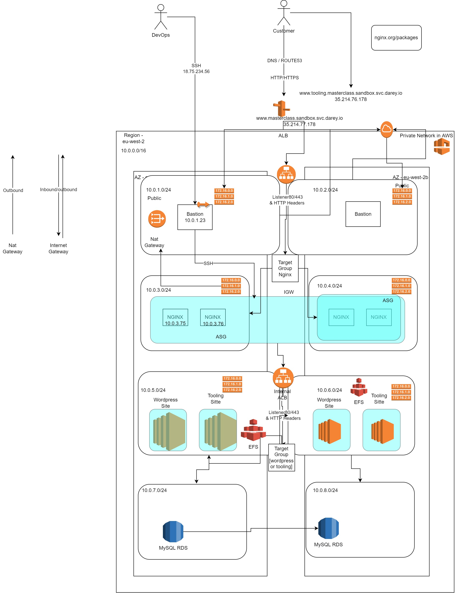

WE shall be creating the infrastructure as shown below

Step 1 - Create VPC named ACME-vpc

---

Step 2 - Create Subnets in ACME-vpc
- Subnets are private by default
- We shall create 2 public subnets and 6 private ones

