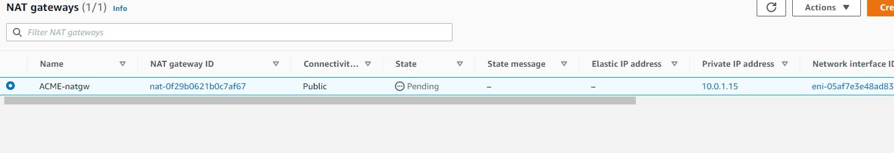

WE shall be creating the infrastructure as shown below

#### Step 1 - Create VPC named ACME-vpc

---

#### Step 2 - Create Subnets in ACME-vpc
- Subnets are private by default
- We shall create 2 public subnets and 6 private ones. 1 private and 3 private in each AZ (eu-west-2a and eu-west-2b)

- ACME-public-bastion-1  
- ACME-public-bastion-2
- ACME-private-proxy-1
- ACME-private-proxy-2
- ACME-private-web-1
- ACME-private-web-2
- ACME-private-data-1
- ACME-private-data-2
---

---
---
#### Step 3 - Create Internet Gateway for ACME-vpc named ACME-igw

- Create Internet Gateway ACME-igw

#### Step 4 - Attach Internet Gateway ACME-igw to ACME-vpc

- Attach Internet Gateway ACME-igw to ACME-vpc

- Successfully attached

---
#### Step 5 - Create route table for public subnet to reach the internet through the internet gateway ACME-igw
- Create route table ACME-rtb-internet

---
- With route table selected, go to edit routes 

- Create route to internet gateway 0.0.0.0/0 for all traffic

---

#### Step 6 - Associate Public Subnets to the route table
- Go to edit subnet associations and select the public subnets then click on save associations

---
#### Step 7a - Create Elastic IP for NAT Gateway

- Create Elastic IP 

#### Step 7b - Create a NAT Gateway in the public subnet so that servers in the private subnet can reach the internet

- Create NAT Gateway
- Allocate IP Address
- Attach to public Subnet 1

#### Step 8 - Creat route table for Private Subnet

- Create Route table
- Edit route
- Target is NAT-gw

